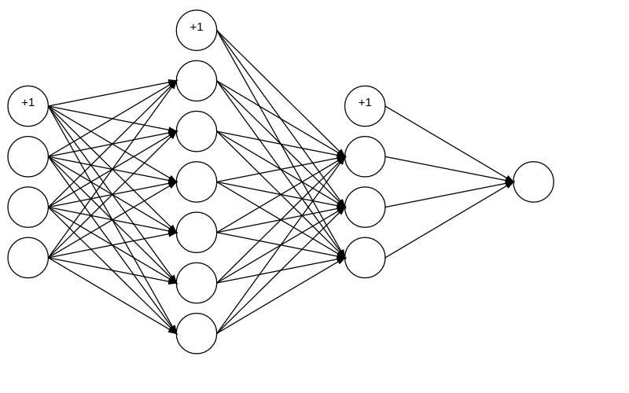

Draw simple multi-layer neural network using cavans.

The codes are ugly, this is my first time writing javascript.

I borrow some codes from http://deepliquid.com/blog/archives/98, which help my draw line with arrow. 

## usage
change these three lines in index.html to your need.

index.html
```
var networkLayer = [4, 7, 4, 1];
var bias = true;
<canvas id="myCanvas" width="800" height="500"></canvas>
```
## example


